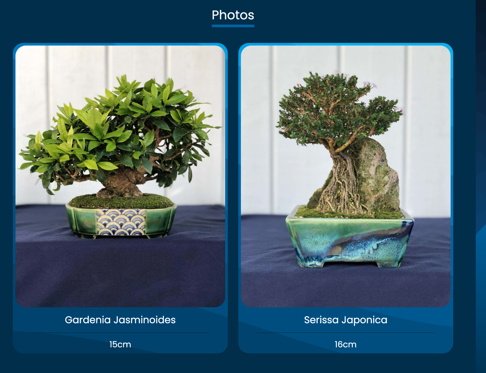
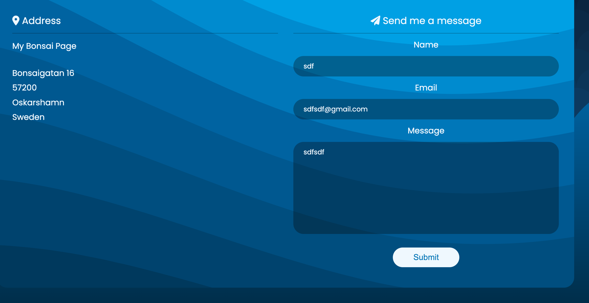
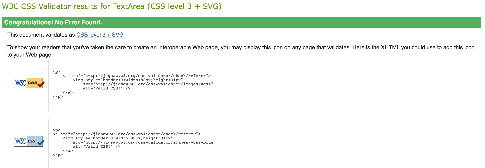

# My Bonsai Page

For the first milestone assignment with Code Institute, I have created a website that showcase some of my personal bonsai collection.
The site is targeted toward people who have an interest in bonsai trees and would like to know more about this hobby and get inspired to start their own collection.

The photos on this website were taken by mittnamnkenny.

[View the live project here.](https://mittnamnkenny.github.io/bonsai-page/)

## User Experience (UX)

-   ### User stories

    -   #### First Time Visitor Goals

        1. As a First Time Visitor, I want to easily understand the main purpose of the site.
        2. As a First Time Visitor, I want to be able to easily navigate throughout the site.
        3. As a First Time Visitor, I want the site to be visually appealing regardless of screen size.
        4. As a First Time Visitor, I want the links to function as expected.

    -   #### Returning Visitor Goals

        1. As a Returning Visitor, I want to learn more about bonsai by visiting Bonsai Empire via the link provided.
        2. As a Returning Visitor, I want know where the collection is located.
        3. As a Returning Visitor, I want to be able to contact the owner of the site.
        
    -   #### Frequent User Goals
        1. As a Frequent User, I want to see if there are any updates in the photo section.

## Features 

### Existing Features

#### Header

  - The header is featured at the top of the page.
  - Shows the logo in the left corner with a styled Font Awesome icon (fa-tree).
  - When the logo is clicked on it will take the user to the top of the page.
  - The right part contains a link to the Swedish version of the page, text Svenska.

  

#### Navigation

  - The navigation links are positioned on the left-hand side of the page, below the logo.
  - When on smaller devices the navigation goes underneath the header and is centred.
  - Home, about, photo and contact which direct the user to the correct sections of the page.
  - The navigation uses position sticky, it allows the user to easily navigate as it will always be visible when scrolling the page.
  - The navigation links all change text colour when hovered over.

#### Hero image

  - This section includes a background image from Crespi Bonsai Museum in Italy.
  - The background uses position fixed on large screen sizes, this intend to give a nice effect when scrolling down the page.
  - A large text overlay with a Welcome to my bonsai page message.
  - A dark background colour on the text helps with contrast issues.

#### About Section

  - This section identifies the purpose of the page and provides brief information about bonsai.
  - A link to Bonsai Empire website, opens in new tab. This should encourage the user to learn more about bonsai.
  - On large screen sizes a circle is positioned at the top-right side with the Crespi Bonsai Museum background image.
  - For a smooth transition (on large screen sizes) to the photo section two SVG-waves are positioned at the bottom, softr.io

#### Photo Section

  - This section is valuable to the user as they will be able to view high quality photos of shohin trees.
  - Shows 4 images of different bonsai trees with size information, 2 bonus images.
  - On large screen sizes the images are shown 2 in a row and on mobile 1.

#### Contact Section

  - The contact page consist of address information and a contact form with text area.
  - Name, email and message is required to be able to submit the form.
  - The input button change text colour when hovered over.

#### Meta Data

  - Bonsai page for bonsai enthusiasts.

### Features Left to Implement

- A Fav icon.
- A form submitted feature.

## Design

- I have used blue as main colour theme for this website. Indigo blue is often used when displaying bonsai and on bonsai excebitions.
- For text color aliceblue were chosen as this goes with the theme of the website and is easy to read.
- Scalable Vector Graphic were used for background images with a fallback background colour if image should fail to load.
- Three svg-waves were used to improve the overall design.

## Technologies Used

- HTML5
- CSS3
- [Google Fonts:](https://fonts.google.com/) To import font family ’Poppins’ into the style.css file which is used on all pages.
Added fallback font sans-serif.
- [Font Awesome:](https://fontawesome.com/) Was used in header and contact section to add icons for aesthetic and UX purposes.
- [SVG Backgrounds:](https://svgbackgrounds.com/) Scalable Vector Graphic used for main background and on page-wrapper. Should the background image fail there is a fallback background color set so that text will be readable and page still functions.
- [SVG Wave Generator:](https://softr.io/tools/svg-wave-generator/) Used to generate a gradient SVG wave, used in both body and about section.
- [Tiny PNG:](https://tinypng.com/) Compressing images to smaller sizes.
- [Am I Responsive:](http://ami.responsivedesign.is) Checking the responsive.
- [Git](https://git-scm.com/) Git was used for version control by utilizing the Gitpod terminal to commit to Git and Push to GitHub.
- [GitHub:](https://github.com/) GitHub is used to store the projects code after being pushed from Git.

## Testing

### Browser testing
- I have tested that this page works in the following browsers: Chrome, Safari and Firefox.
- I have tested this page works on iOS devices (Iphone X and iPad Air).

### Responsivness
- Chrome developer tool have been used to check the responsivness.
- I have tested that this page works on different screen sizes from iPhone 5 (320px wide) and very large screens like 5K iMac Pro (5120 x 2880 px).

### Validator Testing 

The W3C Markup Validator and W3C CSS Validator Services were used to validate all pages of the project to ensure there were no syntax errors in there.

- W3C Markup Validator

- W3C CSS Validator

I have confirmed that the colours and fonts chosen are easy to read and accessible by running it through lighthouse in Chrome developer tools.

- Lighthouse

### Further Testing

- I have tested that the links in the header works correctly.
- I have tested that the navigation links work and the user is directed to the correct sections of the page.
- I have tested that the navigation links change text colour when hovering over.
- I have tested that the external link in the about section opens in a new tab and that the address is correct.
- I have tested that name, email and message is required to submit the form in the contact section.
- I have tested that the email input field must contain @ symbol to submit the form in the contact section.
- I have tested that the form submit button change text colour when hovering over.

### Solved bugs

- When testing on iPhone, I realized that background-attachment: fixed used on the hero image was not displaying correct.
  Property value local was added in the media query to fix this issue.

- When testing different screen sizes using Chrome developer tools, I realized that the submit button need to stand out more for accessibility.
  I increased the padding of the button and changed the background colour to aliceblue.

## Deployment

